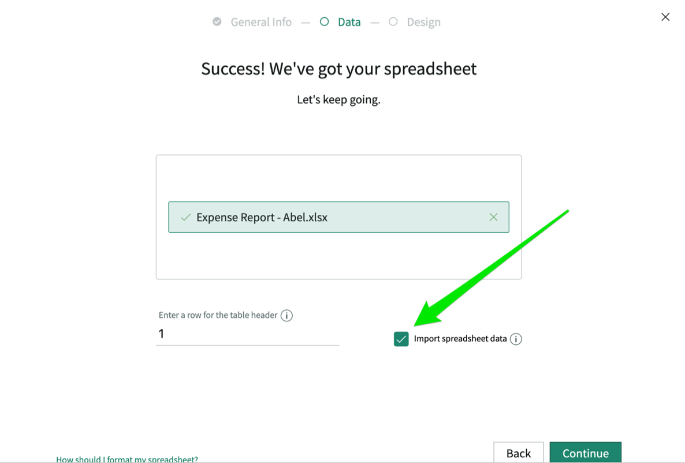
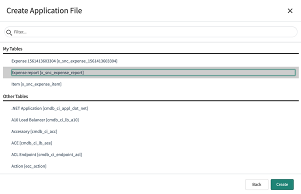
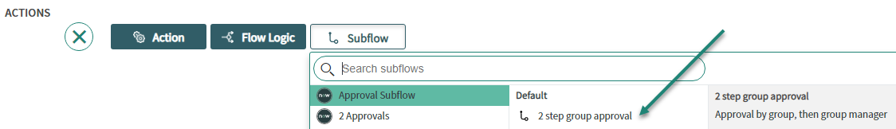
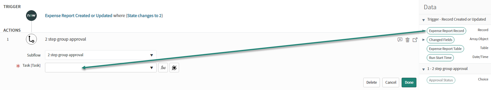
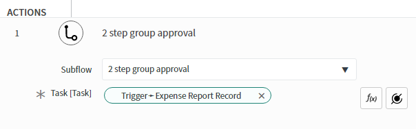
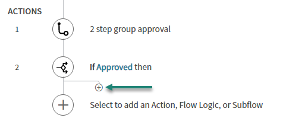
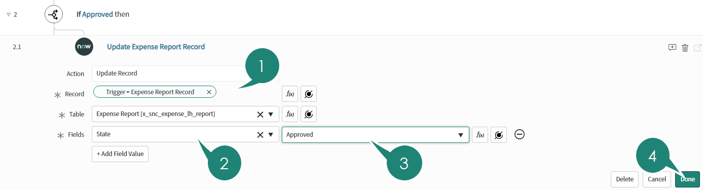
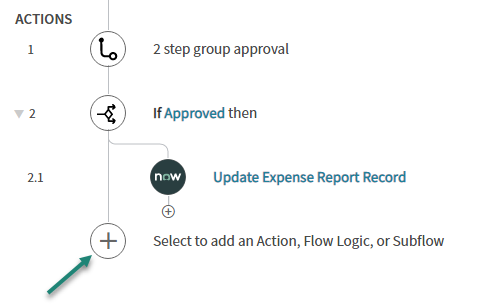

# From spreadsheet to no-code app in minutes

Level: Basic

In this lab you will create a new application on the Now Platform from the ground up. You'll be guided through the process of what data you'll need, learning how to import data from a simple spreadsheet and configuring the experience – all without writing a single piece of code.
You'll leave this lab having built your first fully functional application!

Application/Capabilities:

* App Development
* Now Platform
* Process Automation
* User Interface
* Target Personas:
* Beginning ServiceNow Developer
* Builder
* Pro Developer New to ServiceNow

## Getting Started

### Goal

The goal of this lab exercise is to get familiar with the tools available to define the general information needed for your new app.

1. Begin by logging in to your ServiceNow instance with your credentials.
1. Use the left navigation panel to navigate to System Applications> Studio. You can find it easily by typing Studio in the filter at the top of the left menu.

    

1. A new browser tab appears. This is Studio, our integrated development environment (or IDE). This is simply a tool to help manage all the parts of your application. When the popup appears asking if you want to create or import, select Create Application.

    

1. From the welcome screen, click Let's get started.

   

1. The wizard on the screen walks you through the process of building your application. Begin by filling out the name and description.

    | Field | Value |
    | --- | --- |
    | Name | Expense |
    |Description | Manage our expense reports |
    | Scope | (leave unchanged) |

1. If you choose, add an icon for your application. This is optional and does not affect your overall application.

    

1. Click Create.
1. On the next screen (Let's create some roles for this app), click the Create new role link.

    

1. Under New role name, enter user and click Create.

      

    Note the role name is appended to the application scope name. The full name of the role should be something like x_snc_expense.user.
1. Create additional roles for approver and admin.

    

1. Click Continue.
1. From the screen Which formats do you want to use for this app?, click Workspace, Mobile and Classic. 

    

1. Click Continue.

## Defining the Data

### Goal

The goal of this lab exercise is to create the basic data structure for expense reports and line items. The first exercise is to create an expense report table, then a second table for line items based on the legacy spreadsheet. Additionally, you will add some basic access control to the roles defined earlier.

### Create the Expense Report Table

1. From the screen Which data tables do you want to use for this app?, click Create new table.

    

1. On the next screen, choose Extend a table. In the dropdown list below that option, select Task. Note, you can start typing Task to avoid lengthy scrolling.

    

1. Click Continue.
1. From the screen labeled Great! Let's get going on defining your new table, click Continue.

    

1. On the next screen, in the Table label field, enter Expense report.
1. In the Table name change the default name (x_snc_expense_expense_report) to x_snc_expense_report. After all, who needs the word expense in the table name twice? We can fix that, so why not?!
1. Check the Auto number field and a few additional fields appear. Leave the values as their defaults, they're fine.

    

1. Click the Manage access link near the bottom left.
1. To ensure data integrity, we defined a role for each persona earlier. Now it's time to define what each role can do. Remove Delete permission from the user and approver roles. Typically, only an admin should delete records and even then it should be under extreme circumstances.
1. Next, remove Create permission from the approver role. They shouldn't be creating new expense items.
Your access should now look like the following image:

    

1. Click Continue. Your screen should now show success for the Expense report table. Congratulations. Go ahead and click Continue again.

    

### Import the Expense Items from Spreadsheet

1. Once again, click Create new table.

    

1. This time, choose Upload spreadsheet, then click Continue.

    

1. Download the sample file: [Expense_Report-Abel_Tuter.xlsx](expense_report-abel_tuter.xlsx).
1. Drag your copy of the downloaded file to the dialog window or click the link and browser to upload it to ServiceNow.

    

1. After uploading the file, check the Import spreadsheet data checkbox.

    

1. Click Continue.  
    ServiceNow will take a moment to process your spreadsheet. It determines what fields to create based on the column headings in your spreadsheet. It also stages the spreadsheet rows before placing them in the resulting ServiceNow table. When complete, it displays the screen below.

    

1. Before modifying any existing fields, click Add a new field to connect the new table with spreadsheet information to the existing Expense report table.
1. Fill in the fields from the follow table:

    | Name | Value |
    | --- | --- |
    | Field Label | Expense report |
    | Field name | expense_report |
    | Field type | Reference |
    | Reference table | Expense report [x_snc_expense_report] |

    

1. At this point you get to address the issue of data consistency and give an improved experience in ServiceNow. The Now Platform offers more field types than Excel does so it makes sense to take advantage of them. For example, rather than having someone enter their name, they can pick it from a predetermined list. Begin by locating the Receipt status row and clicking the down arrow next to String.

1. From the dropdown list, choose Choice.

    

1. After choosing Choice, note that the right column changes to Choice type. Choose the option Dropdown without none.

    

1. Click the down arrow next to the choice type to reveal the choice options.

    

1. Click the link + Add a new choice.

    

1. Add the Display value of Yes and System value of yes.

    

1. Repeat the process of adding a new choice to add a Display value of No and System value of no.

    

1. Using the same method, change the field type of Expense type from String to Choice, and Dropdown with none.
1. In the choice options, check the box Mandatory.
1. Add the choices in the following table:

    | Display value |System value |
    | --- | --- |
    | Transportation | transportation |
    | Dining | dining |
    | Hotel | hotel |

    

1. Finally, change the Employee field type to Reference.
1. Set the Reference table to User [sys_user].

    

1. Click Continue.
1. On the following screen, fill in the Table label as Item. (The table name will auto-populate. Leave it as is.)

    

1. Click the Manage access option at the bottom of the form. Note, you may have to scroll to see all the options. This is where we set "who has what access" to your records.
1. To ensure data integrity, we defined a role for each persona earlier. Now it's time to define what each role can do. Remove Delete permission from the user and approver roles. Typically, only an admin should delete records and even then it should be under extreme circumstances.
1. Next, remove Create permission from the approver role. They shouldn't be creating new expense items.  
   Your access should now look like the following image:

    

1. Click Continue. If everything worked, you should have a screen like this:

    

1. Click Continue.
1. At this point ensure both the Expense report and Item tables are selected and click Done with tables.

    

## Designing Your App

### Goal

The goal of this lab exercise is to define the user experience your app presents. In the earlier lab, you chose Workspace and Classic. This section completes the details needed to access your app through either of these interfaces.

### Configuring Workspace

1. On the Workspace row, click Start.

    

1. This screen really doesn't need any configuration. You can optionally put in a description if you like.

    

1. Click Continue.
1. The Workspace UI provides two options for navigating records. Tabbed navigation and Single page navigation. Each has their strengths based on the use case. For our expense report app, click Tabbed navigation then click Continue.

    

1. In the following window, click Continue.

     

1. In the following window, click Continue.

    

1. Validate your workspace configuration by clicking Open.

    

> IMPORTANT: Note the URL **https://\[yourinstance\].service-now.com/now/workspace/expense/home**

### Configuring Mobile

1. Return to the Studio browser tab.
1. Click Start (shown below) to configure the Mobile UI.

    
    

1. Make sure that snc_expense_admin role is selected here as well
1. Leave the rest this as is and click on Create

### Configuring Classic UI

1. Return to the Studio browser tab.
1. Click Start (shown below) to configure the Classic UI.

    

1. In the following screen, click Create.

    

1. Click Done with apps.

    

1. Click Done.

    

## Designing Your Form

### Goal

The goal of this lab exercise is to build the form for your application. You will add the details of the form and list layout to the item and expense report tables in the classic interface.

### Expense Report form Layout

1. In Studio, use the Application Explorer on the left to navigate to **Data Model\> Tables\> Expense Report**.

    

1. In the form that appears, scroll down to the Related Links section and click Design Form.

    

1. The Form Designer window appears with the current default layout for the Expense Report form. Using the "X" on the right hand side of the field, remove the following fields from the form layout:

    * Priority
    * Parent
    * Configuration item

    

1. On the left, use the list of fields to select the following fields and drag them on to the form designer.

    * Opened by
    * Activities (filtered)

    

1. Click the gear icon next to State to configure the choices as follows:

    | Label | Value |
    | --- | --- |
    | Pending | (deleted) |
    | Draft | 1 |
    | Approval | 2 |
    | Approved | 3 |
    | Rejected | 4 |
    | Canceled | 7 |

    

1. Click the "X" in the upper right of the Properties popup window to close it.
1. Organize the other fields on the form to make the form appear similar to the following:

    

1. Next, click the Save button in the upper right of the form.

1. Now that the default view is defined, replicate the form layout to workspace. Begin by clicking the dropdown next to Default view at the top of the Form Designer and choosing New.

    

1. In the popup that appears, enter the view name workspace and click OK.

    

1. Save the form design again by clicking Save in the upper right.

### Add the related lists for Classic UI and Workspace UI

1. Within Studio, click the Create Application File link in the upper left corner.

    

1. In the window that appears, select Forms & UI> Related List.

    

1. Click Next.

1. Under My Tables, click your Expense report [x_snc_expense_report]. The naming convention for your Report may be different, so just select the report you created.

    

1. Click Create.
1. Select the ”Approvers” and ADD this to the selected using the arrow:

    

    

1. Click Save to save the work on the related list for the Classic UI.

1. At the bottom of the form, locate the View name field and select New.

    

1. In the Create New View window that appears, type in the View name workspace and click OK.

    

1. Scroll down the Available list on the left and select the Item->Expense report entry.

    

1. Use the \> icon to move the entry from the left to right.
1. Press the Save button
1. Next you will create a related list in the Workspace view.
1. Do the same for Approvers Related list

    

1. Click Save.
1. Validate your work by going to your Workspace browser tab.
1. Click the Lists icon (☰) on the left.
1. Navigate to Expense reports> All and click New.

    > Note:
    If a blue display message appears, use the "X" to close it in order to display the Save button.
1. Click Save.
1. You should now see the Items list as shown in the image below.

    

## Create your workflow

### Goal

The goal of this lab exercise is to create a simple workflow on your application. You will add create the trigger for the workflow, include the approval subflow, add a few actions, and test the workflow.

1. In Studio Create New Application File, Flow and Click Create.

    

1. Select Flow and click Next

    

1. Change the Flow properties and add the Name: Approval.

    

1. Click on Submit to save the changes.

    
 
### Set the trigger

1. Click on the + sign to open the options for setting the trigger
1. Select “Created or Updated”

    

1. Select the Expense report Table

    

1. Add the Condition you want to use for this trigger by Clicking on the + Sign “Add filter”: **State \> changes to \> Approval**

    

1. Select “For each unique change”, as we want this to occur anytime this record changes and confirm with **Done**.

    

### Include subflow and create actions

1. Click the **(+)** sign to add a _Subflow_.
1. Choose "2 step group approval".

    

1. Drag the **Data pill** "Expense Report Record" to the "Task" field in the Subflow.

    
    

1. Confirm with **Done**.
1. Click the **(+)** sign to add _Flow Logic_.
1. Choose **If**.
1. Set **Condition:** to "Approved".
1. Drag the **Data pill** "1 - 2 step group approval \> Approval Status" to **Condition 1:**.

    

1. Set **Approval Status \> is \> Approved**.

    

1. Confirm with **Done**.
1. Below the if branch, click the small **(+)** sign to add _Flow Logic_.

    

1. Click on **Action**, filter for "Update", and choose **Update Record**

    

1. Drag the **Data pill** "Expense Report Record" to the "Record" field in the Action.
1. Click **+ Add Field Value**.
1. Select a field: **State**.
1. Select a choice: **Approved**.
1. Confirm with **Done**.

    

1. In the main thread of the flow, click the **(+)** sign to add _Flow Logic_.

    

1. Choose **Else If**.
1. Set **Condition:** to "Rejected".
1. Drag the **Data pill** "1 - 2 step group approval \> Approval Status" to **Condition 1:**.
1. Set **Approval Status \> is \> Rejected**.
1. Confirm with **Done**.

    

1. Repeat the above steps with the option "Rejected":
1. Below the else if branch, click the small **(+)** sign to add _Flow Logic_.
1. Click on **Action**, filter for "Update", and choose **Update Record**
1. Drag the **Data pill** "Expense Report Record" to the "Record" field in the Action.
1. Click **+ Add Field Value**.
1. Select a field: **State**.
1. Select a choice: **Rejected**.
1. Confirm with **Done**.
1. The complete flow should look like this:

    

### Testing the created workflow

1. Click on the Test button to test your workflow:

 

1. Click on the + sign to create a new record so you can Test the flow.

1. This opens the Request form for the Expense report. Add a Short Description, make sure to change Opened by to “David Loo” and Click Submit
 
 

1. Click Run Test and wait for the Flow to be executed. The message “Flow has been executed. To view the flow, click here.”. Click on the Green link.

 

1. Below you will see all the details for the Flow. 

Note:
The state is waiting, due to the requested approval
 
1. Click open Current Record (twice) to go to the Expense record 

 
 
1. Click open Current Record (twice) to go to the Expense record 
1. Go to the approver related list right click on the name and select approve
 
Note:
The approval was sent to the manager of David Loo, by the flow we created. Because we are logged in as administrator we can overwrite the approval. Normally this can be done via email or mobile app.

1. The ticket state should now change to approved, and this change is shown in the activities. If not reload the page

 

1. Refresh the flow history, review it and make sure you understand the steps.

## Finishing Touches

### Goal

The goal of this lab exercise is to put the finishing touches on your application. You will add the details of the form and list layout to the item and expense report tables in workspace interface.

Add the Items List to the Classic UI Expense Report Form

1. Back in Studio, click Layout Form on the Expense report table definition.
 
1. Scroll down the Available list on the left and locate the entry Item->Expense report.
 
1. Use the > to move it to the Selected list on the right.
 
1. Now use the up and down arrows to place it between Description and Activities (filtered).
 
1. Click Save.
1. Validate your work by going to the classic UI browser tab.
1. Navigate to Expense report> Open.
1. Locate and click any record number in the list. Your form should appear similar to the following image.
 
### Configure Item Form Layout

1. From Studio, open the Item table record.
1. Click the Design Form link.
1. Arrange the fields similar to the image below and click Save.
 
1. Create a new view called workspace the same way you did for the Expense report form design.
    1. Use the dropdown next to Default view
    1. Click New.
    1. Enter the view name workspace.
    1. Click OK.
    1. Click Save.

1. Validate your work in Workspace by going to Lists> Items> All and open a record. Your form should appear similar to the following:
 
### Configure the Items List Layout in Workspace

1. Next, let's clean up the default list layout for the items in Workspace. Begin by going to the classic UI and navigating to Workspace> List Filters.
 
1. Using the list filter, locate the records with Category Items.
 
1. Click the Run button.
1. Open the record with the list name All.
 
1. Click the lock next to the Columns field.
1. Arrange the items in the Selected column using the left/right and up/down arrows to reflect the list below:
    * Transaction date
    * Account
    * Amount
    * Business purpose
    * Employee
    * Expense report
    * Expense type
    * Receipt status
    * Vendor name

 
Your columns should now look like this:
 
1. Click Update.
1. Validate your work by going to workspace and refreshing your browser window.
Note, do not use the list refresh icon. You should see your new list layout take effect.
 

 
## Challenge exercises:
### Add a Module to Navigate to the Workspace
1. In Studio, click the Create Application File link.
1. Go to Navigation> Module and click Create.
 
1. Fill in the form with the following names and values:

| Name | Value |
| --- | --- |
| Title | Workspace |
| Application menu | Expense |
| Order | 0 |
| Link type | URL (from Arguments) |
| Arguments | /now/workspace/expense/list (Or if you imported the app use: /x/myapps/workspace/expense/list) |
| Window name | _blank |
 

1. Click Submit.
1. Validate your work by refreshing the Classic UI browser tab and navigating to Expense> Workspace.
 
### Configure the Classic UI Expense Report List Layout

1. In the classic UI, navigate to **Expense \> Expense report \> Open**.
1. From the list, click any column heading menu (☰) and choose Configure> List Layout.
 
1. Using the same method as earlier, select the following columns on the right.
    * Number
    * Opened by
    * State
    * Assigned to
    * Short description

1. Click Save.
 
1. Verify your work by inspecting the list layout as shown below:
 
### Associate the Existing Items to an Expense Report
1. In the classic UI, update the Opened by field from the Expense report list view by double-clicking on the table cell of the record (being careful not to click the link).
 
 
1. Type the name Abel Tuter and click the green checkmark.
Note: Abel Tuter matches the name on the expense item records imported earlier.
 
IMPORTANT: Make note of the expense report record number you updated!

1. Navigate to Expense> Item> All.
 
1. Hold down the shift-key and drag your cursor to select the records where the Expense report column displays (empty)
 
1. Double-click next to the word (empty) to edit multiple cells.
 
1. Enter the expense report number or use the magnifying glass ( ) to locate the record and click the green checkmark to save your results.
 
1. Validate your work by navigating to Expense> Expense report> Open.
1. Open the record you just added the items to.
 
 
1. Verify your screen looks similar to the one below with the line items in the list.
 
### Import a second Spreadsheet of Items

1. Download the second Excel spreadsheet Expense_Report-Luke_Wilson.xlsx.
1. In the classic UI, navigate to Expense> Item> All.
 
1. From the list, click any column heading menu (☰) and select Import.
 
1. On the screen that appears, uncheck Do you want to create an Excel template to enter data?.
1. Click Choose File and navigate to the location where you saved your downloaded file.
 
1. Click Upload.
1. When the upload is complete, click Preview Imported Data.
 
1. Verify there are 4 rows of records imported and no errors or warnings.
1. Click Complete Import.
 
1. Validate the records were imported to the Items table.
1. Optionally, create a new expense report record for Luke Wilson and associate the new items to the Expense report.
1. Does Luke's expense report show his imported items?

### (OPTIONAL) Create Approval subflow

For the purpose of this lab, we'll create a subflow with 2 approval steps. The first is a simple manager approval, the approval will be assigned to the manager of the person that created the Expense report (Opened by). Once the manager has approved, a second approval will be assigned to a group. Every member of the group will receive an approval record. As soon as one member of the group approves, the result will be assigned to the subflow output. If the manager has not approved, this result will then be assigned to the output. This output can be used in the parent flow.

> **What is a subflow?**  
> A subflow is a sequence of reusable actions that can be started from a flow, subflow, or script. Define inputs and outputs to pass data to and from the subflow.  
> All subflows consist of _properties_, one or more _inputs_, one or more _outputs_, a sequence of _actions_, and the _data_ collected or created. Unlike flows, subflows:
>
> * Do not have a trigger and are instead started from a parent flow, subflow, or script by a method call.  
> * Include inputs to specify data available to the subflow when it starts.  
> * Include outputs to specify data available to the parent flow after the subflow ends.
>
> Using subflows, process analysts can:
>
> * Create a set of reusable operations for use in multiple flows.  
> * Add flow logic in addition to actions.  

1. In Studio, click **File**, choose **Switch**, then click on **Create Application**
1. Name your application "Approval Subflow" with the scope "x_snc_approval_sf" and click **Create**

    

1. Choose **Continue in Studio (Advanced)**.

    

1. Open your application **"Approval Subflow"**.
1. Within Studio, click the Create Application File link in the upper left corner.
1. Filter for "Flow" and click on **Create**.

    

1. Choose "SubFlow" and click **Next**.

    

1. Name your subflow and optionally add a description. Click **Submit**.

    

1. With the plus sign **(+)** on the right of the input section, add an input to your subflow, label it "Task", check that the Name is "task", and from the Type picker choose **Reference \> Task \[task\]**. Make this input **Mandatory**

    

1. With the plus sign **(+)** on the right of the output section, add an output to your subflow, label it "Approval Status" and set the Name "approval_status", and from the Type picker choose **Choice**.

    

1. Under **Advanced options** change **Create new choice list** to **Reference existing choice list on a table** and set the **Choice table** to "Approval \[sysapproval_approver\]", set **Choice field** to "State", and **Default value** to "Cancelled". Then click **Done**.

    
 
1. Click the **(+)** sign to add an _Action_ for this subflow.
1. Click on Action
1. Select **Ask For Approval** Action

    

1. Drag the **Data pill** "Task" from the Subflow Inputs on the right into the field "Record".
1. Set the **Rules** to "Approve or Reject" When: "Anyone approves or rejects".
1. From the pill picker next to the approval conditions navigate to **Subflow Inputs \> Task \> Opened by \> Manager**.
1. Confirm with **Done**.
1. (Optional) Add a comment "Manager Approval" to approval step.

    

1. Click the **(+)** sign to add _Flow Logic_ to this subflow.
1. Choose **If**.

    

1. Set **Condition:** to "Manager approves".
1. Drag _Approval State_ from **Step 1- Ask for Approval** to **Condition 1:**. Select "is" and "Approved".
1. Confirm with **Done**.

    

1. Click the **(+)** sign below the **if** to add an _Action_ in this branch.

    

1. Click on Action
1. Select **Ask For Approval** Action
1. Drag the **Data pill** "Task" from the Subflow Inputs on the right into the field "Record".
1. Set the **Rules** to "Approve or Reject" When: "Anyone approves or rejects".
1. From the icon with 2 people choose the Assignment Group "Service Desk".

    

    

1. Confirm with **Done**.
1. (Optional) Add a comment "Group Approval" to approval step.
1. Below the group approval, click the **(+)** sign to add _Flow Logic_.
1. Choose **Assign Subflow Outputs**.

    

1. Click on the **(+)** sign on the right, select output "Approval Status" and from the pill picker, choose **2.1 - Ask for Approval \> Approval State**.

    

    

1. Confirm with **Done**.
1. (Optional) Set step comment to "Assign group approval state to output" to Assign output step.
1. In the main thread of the flow, click the **(+)** sign to add _Flow Logic_.
1. Choose **Assign Subflow Outputs**.

    

1. Click on the **(+)** sign on the right, select output "Approval Status" and from the pill picker, choose **1 - Ask for Approval \> Approval State**.

    

1. Confirm with **Done**.
1. (Optional) Set step comment to "Assign manager approval state to output" to Assign output step.
1. (**Save** and) **Publish** the subflow.
1. The complete Subflow should look like this:

    